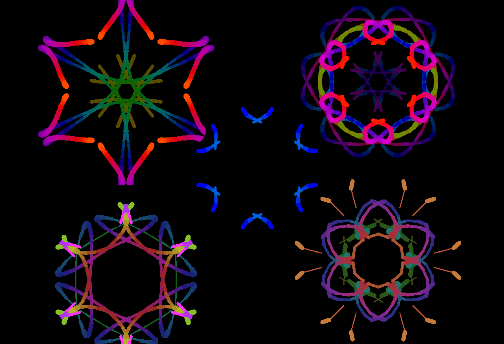

# kaleidoscope air draw

a small fun project I did using opencv and mediapipe (newer version) for a webcam-based drawing app that turns hand gestures into a kaleidoscope. 
point your index finger to draw, then the stroke gets mirrored and tiled around in real time,
with fading trails and color gradients. 
<div align="center">
  

</div>

## repo structure

- **`vision/`** - the graphics pipeline. landmark detection, gesture classification (pinch/fist/open palm), position smoothing, and the startup calibration routine.
- **`capture/`** - camera input handling. 
- **`drawing/`** - kaleidoscope logic. canvas rendering with fading/mirrored strokes, the symmetry math, and color/thickness styling.
- **`ui/`** - everything rendered on screen
- **`assets/`** - non-code files, currently the mediapipe hand landmark model.
- **`app.py`** - main application class 
- **`main.py`** - builds config, sets up logging, starts the app.
- **`config.py`** - configuration dataclass plus cli/yaml loading.

## setup

```bash
pip install -r requirements.txt
```

## running

```bash
python main.py
```

useful flags:

```bash
python main.py --camera-index 1
python main.py --config config.yaml
python main.py --log-level debug
```
